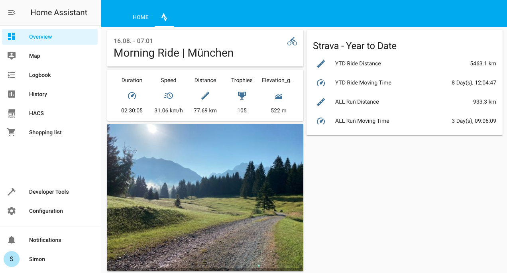

# ha_strava
Custom Component for Home Assistant to integrate your Activity Data from Strava.


## Features
* Gives you access to **up to 10 of your most recent activities** in Strava. 
* Supports both the **metric and the imperial** unit system
* Activity data in Home Assistant **auto-updates** whenever you add, modify, or delete activities on Strava
* **Easy set-up**: only enter your Strava Client-ID and -secret and you're ready to go




For every Strava activity, the Strava Home Assistant Integration creates a **device entity** in Home Assistant (max 10 activities). Each of these virtual device entities comes with the following **sensor properties**:

* Date, Time & Title of the activity
* Duration (based on moving time)
* Pace
* Distance 
* Elevation Gain
* Weighted Average Power
* Calories
* Kudos Count
* Trophy Count

Since every Strava activity gets its own virtual device, you can use the underlying sensor data in your **Dashboards and Automations**, just as you'd use any other sensor data in Home Assistant. To learn how to display information about your most recent Strava Activities, please reference the **configuration examples** below.

## Installation
### First, set up remote access to your Home Assistant Installation
To use the Strava Home Assitant integration, your Home Assistant Instance must be accessible from an **External URL** (i.e. Remote Access). Without remote access, the integration won't be able to pull data from Strava. To learn how to set up Remote Access for Home Assistant, please visit the [Official Documentation](https://www.home-assistant.io/docs/configuration/remote/)


### Second, obtain your Strava API credentials
After you've set up remote access and configured the External URL for your Home Assistant instance, head over to your **Strava Profile**. Under "**Settings**", go to "**My API Application**", follow the steps in the configuration wizard, and eventually obtain your Strava API credentials (ID + secret). We need those credentials during the final installation step.

### Third, add the Strava Home Assistant Integration to your Home Assistant Insallation
There are two ways to add the Strava Home Assistant Integration to your Home Assistant Installation. The recommended way is to install the integration through [HACS](https://github.com/custom-components/hacs). If you want to do the installation manually, copy the entire `custom_components/ha_strava/` folder into the `custom_components/` directory within your Home Assistant configuration folder.

### Fourth, make a connection between your Strava account and Home Assistant
Now is the time to fire up the Strava Home Assitant Integration for the first time and make a connection between Strava and your Home Assistant Instance. 


From within Home Assistant, head over to `Configuration` > `Integrations` and hit the "+"-symbol at the bottom. Search for "Strava Home Assistant" and click on the icon to add the Integration to Home Assistant. You'll automatically be prompted to enter your Strava API credentials. It'll take a few seconds to complete the set-up process after you've granted all the required permissions.

## Configuration
Upon completion of the installation process, the Strava Home Assistant integration **automatically creates device- and sensor entities** for you to access data from your most recent Strava activities. The number of sensor entities varies, depending on how many of your most recent Strava activities you whish to track from within Home Assistant (9 sensors per activity)

### Increase/Decrease the number of Strava Activities avaiable in Home Assistant
You can always **adjust the number of Strava activities you whish to track** from within Home Assistant (min 1; max 10). 


Just locate the Strava Home Assistant Integration under `Configuration` > `Integrations`, click on `Options`, and use the slider to adjust the number of activities. After you've saved your settings, it might take a few minutes for Home Assistant to create the corresponding sensor entities and fetch the underlying data. The activities available in Home Assistant always correspond to the most recent ones under your Strava profile.

### Integrate Strava Activities into your Home Assistant UI
Below, you can find an example UI-configuration (.yaml) which adds metrics from your two most recent Strava activities to a separate Lovelace Dashboard in Home Assitant:

```yaml

```
